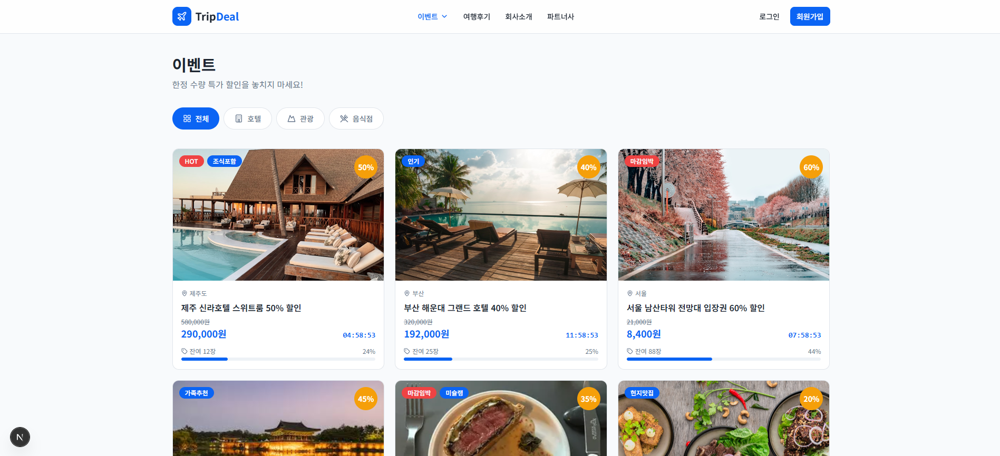
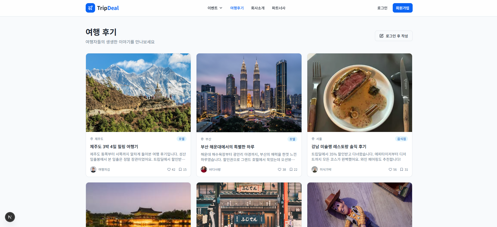

# ✈️ TripDeal
> **안정적인 여행 커뮤니티 및 타임세일 이벤트를 위한 고가용성 인프라 구축 프로젝트**

단순한 기능 구현을 넘어, **특정 시즌(성수기)과 선착순 이벤트 시 발생하는 트래픽 폭증**, 그리고 **예상치 못한 서버 장애** 상황에서도 서비스가 안정적으로 유지될 수 있도록 인프라를 설계, 구현 및 검증하는 프로젝트입니다.

---

## 📌 1. 프로젝트 개요 (Project Overview)
* **목적**: 평시/이벤트/장애 상황별 시나리오 기반 인프라 운영 및 검증
* **배경**: 여행 서비스 특성상 특정 시간대 트래픽 집중 및 서버 장애 시 발생하는 금전적 손실과 사용자 불만 해결 필요
* **핵심 목표**:
    * **비용 효율성**: 평시 최소 리소스로 서비스 운영
    * **고가용성**: 트래픽 폭증 시 무중단 서비스 유지
    * **신속한 대응**: 로그 및 메트릭 기반의 빠른 장애 원인 분석

---

## 🖼️ 2. 서비스 화면 (Service Preview)

| 메인 페이지 | 타임세일 이벤트 | 여행 후기 커뮤니티 |
| :---: | :---: | :---: |
|  |  |  |
| 특별한 여행 상품 제공 | 선착순 한정 특가 딜 | 사용자 생생 후기 공유 |

---

## 🛠️ 3. 기술 스택 (Tech Stack)

### Infrastructure & Orchestration
* **OS**: Linux (Ubuntu) - 서버 운영 표준 및 자동화 유용
* **Virtualization**: KVM - 실무와 유사한 VM 기반 인프라 구성
* **Container**: Docker - 환경 표준화 및 빠른 재현
* **Orchestration**: Kubernetes - HPA를 통한 자동 확장 및 장애 복구

### Backend & Frontend
* **Backend**: Spring Boot - 구조적 안정성 및 API 구성
* **Frontend**: Thymeleaf - 기능 최소화 및 인프라 집중을 위한 SSR 방식

### CI/CD & Observability
* **CI/CD**: GitLab CI/CD - 코드 변경 시 자동 빌드 및 배포 파이프라인
* **Monitoring**: Prometheus & Grafana - 리소스 상태 시각화
* **Logging**: Loki, Fluent Bit - 중앙 집중형 로그 관리 및 장애 추적

---

## 🚀 4. 운영 시나리오 및 검증 (Scenarios)

### 시나리오 1: 평시 운영 (Baseline)
* **내용**: 여행 커뮤니티 게시글 조회/작성 및 낮은 트래픽 유지
* **목표**: 최소 리소스로 비용 효율적인 운영 및 기본적인 모니터링 수행

### 시나리오 2: 이벤트 트래픽 폭증 (Traffic Burst)
* **내용**: 오전 10시 선착순 할인 이벤트 시 대량의 동시 접속 발생 가정
* **목표**: **HPA(Horizontal Pod Autoscaler)**를 통해 트래픽 증가에 따른 Pod 자동 확장 및 무중단 유지

### 시나리오 3: 장애 상황 (Failure Recovery)
* **내용**: 의도적인 Pod/Node 강제 종료 상황 부여
* **목표**: Kubernetes의 자동 복구 기능 확인 및 **Loki/Grafana**를 통한 장애 원인 분석 능력 검증

---

## 🏗️ 5. 구현 범위 (Implementation Detail)
* **사용자 기능**: 게시글 조회/작성, 할인 이벤트 페이지 조회
* **인프라 구성**: KVM VM 구성 → Docker 컨테이너화 → K8s 클러스터 구축 (Ingress, Service, Deployment)
* **자동화**: GitLab Runner를 활용한 CI/CD 파이프라인 구축
* **검증**: 부하 테스트를 통한 인프라 안정성 최종 확인

---
